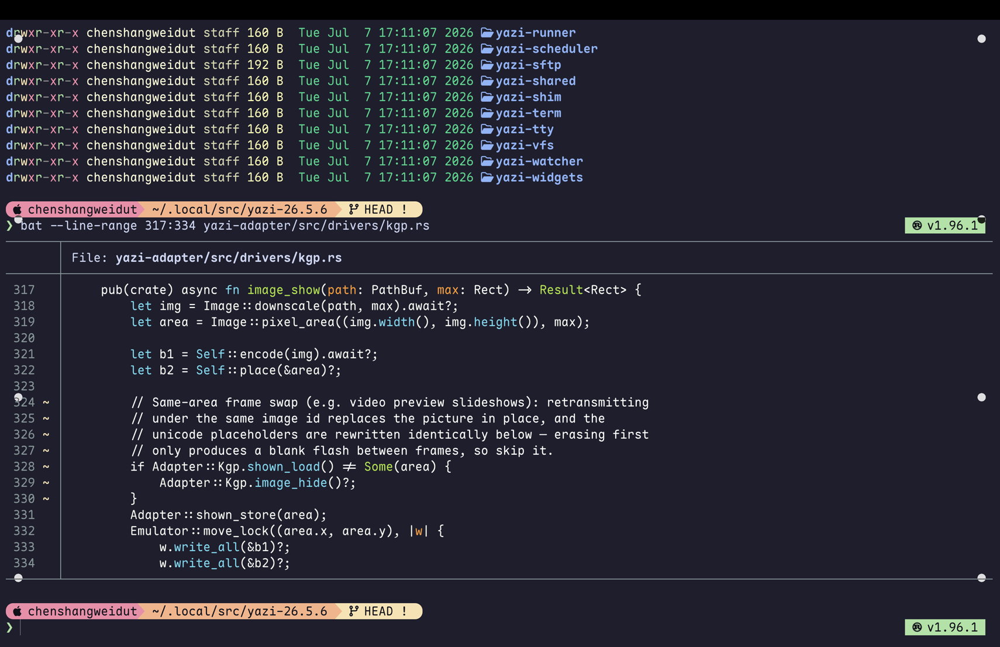
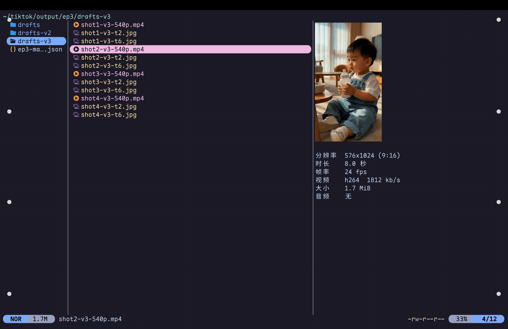
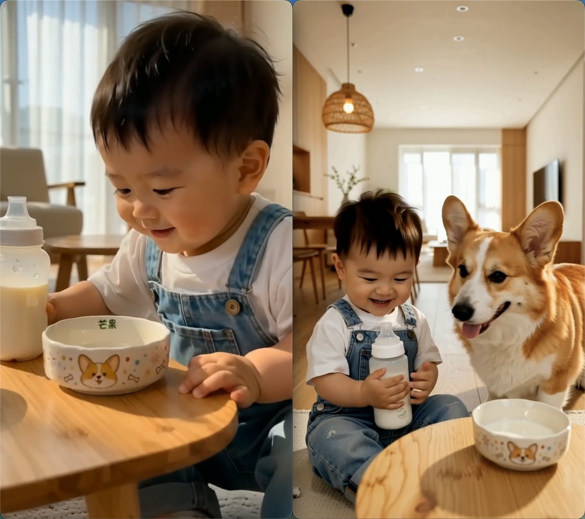
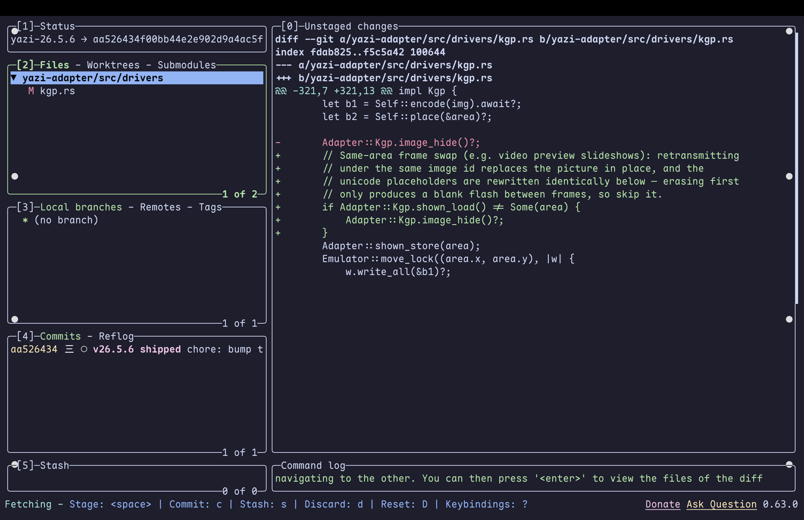

<div align="center">

# 🛠️ VibeCodingEnv

**一套开箱即用的 macOS 终端工作环境**

高颜值终端 · 智能提示符 · 会"播放视频"的文件管理器 · 现代 CLI 工具全家桶

把仓库交给 Claude Code，十几分钟在任何一台 Mac 上完整复刻

</div>

---



<p align="center"><i>↑ 实际效果：Ghostty 毛玻璃窗口、starship 彩色分段提示符、lsd 图标文件列表、bat 语法高亮</i></p>

## 为什么值得装？

macOS 自带的终端体验停留在十年前：纯黑窗口、单调的 `ls` 列表、`cat` 看代码没有高亮、预览一个视频要离开终端去双击。这套环境把日常终端操作升级成这样：

- **打开终端就赏心悦目** —— GPU 加速渲染、半透明毛玻璃、为暗色主题调校过的文字对比度；
- **提示符会说话** —— 当前目录、git 分支和状态、语言版本、上条命令耗时，一眼全有，不用再敲 `git status` 和 `pwd`；
- **文件管理不用离开终端** —— 键盘流浏览文件，图片直接显示在终端里，**视频甚至会自动动起来**（见下文）；
- **每个老命令都有更好的替代** —— `cat`→`bat`（高亮+行号）、`ls`→`lsd`（图标+彩色）、`cd`→`zoxide`（跳转常用目录）、裸 git→`lazygit`（可视化操作）。

## 亮点：会播放视频的文件管理器

yazi 是一个终端文件管理器。本仓库给它配了两个自定义插件和一个源码补丁，把它变成一个**视频审片工作台**：



<p align="center"><i>↑ 光标停在视频上，右侧预览栏自动以约 12fps 连续轮播整条视频，下方显示中文标签的完整参数</i></p>

| 你的操作 | 发生什么 |
|---|---|
| 光标悬停视频 | 预览栏像低帧率播放一样动起来，快速判断内容与运镜；下方显示分辨率（含宽高比）、时长、帧率、编码、码率、体积、有无音轨 |
| 光标悬停图片 | 显示图片 + 分辨率/格式/体积 |
| 回车 | 调用 IINA 播放器弹出 2 倍尺寸窗口，可逐帧细看 |
| 空格多选 + 回车 | 多个播放窗口**自动并排平铺、整组居中**，并排对比不同版本 |



<p align="center"><i>↑ 多选两个视频回车：窗口自动并排、接缝正好在屏幕中线</i></p>

这套能力对谁有用：需要批量筛选视频素材的人（剪辑、AI 生成内容审片、素材库整理），或者单纯想要"终端里预览媒体文件不再是黑盒"的所有人。

> 轮播换帧靠一个 6 行的 yazi 源码补丁（`yazi/yazi-kgp-noflicker.patch`）：利用 kitty 图形协议里"同一 id 重传即原地替换"的特性，换帧时跳过默认的擦除步骤。

## 顺手的 git：lazygit



<p align="center"><i>↑ lazygit：左侧仓库全景（文件/分支/提交），右侧实时 diff——图中显示的正是上述的 yazi 源码补丁</i></p>

暂存某几行、改写提交、交互式 rebase 这些裸 git 里让人头疼的操作，在 lazygit 里都是一两个按键。

---

## 安装

### 方式一：交给 Claude Code（推荐）

克隆仓库后，对 Claude Code 说一句：

> 请按照这个仓库 README 的"分步安装"一节，从第 0 步执行到第 7 步。

### 方式二：手动安装

跟着下面的分步安装逐节执行即可，每节末尾都有验证方法。

> **前提**：Apple Silicon Mac（Intel 也可，见 FAQ）+ [Homebrew](https://brew.sh)。
> 终端需支持 kitty 图形协议（本套默认的 Ghostty 即支持；iTerm2 不适用）。

## 分步安装

> **给 Claude Code 的执行指引**：按第 0-7 节顺序执行，无需询问额外决策。
> 所有配置一律以本仓库内的副本为准，用 `cp` 部署，不要从网络重新下载。

### 0. 前置：字体

```bash
brew install --cask font-maple-mono-nf-cn
```

Maple Mono NF CN 是一款带图标字符（Nerd Font）的中英文等宽字体——终端里的文件夹图标、git 符号、提示符箭头都靠它。

### 1. Ghostty（终端模拟器）

```bash
brew install --cask ghostty
mkdir -p ~/.config/ghostty
cp ghostty/config ~/.config/ghostty/config
```

配置基于 [zhangchitc 的 gist](https://gist.github.com/zhangchitc/7dead7c1b517390e061e07759ed80277)（已复制入库），并在此基础上新增：禁用两个会让 TUI 应用（如 Claude Code）文字重叠的字体选项、最低对比度 4.5:1、`cmd+k` / `cmd+shift+k` 清屏与硬重置快捷键。

配套的 `ghostty/claude-term-fix.zsh` 是 Ghostty 1.3.x 下 Claude Code 渲染异常的变通函数（见第 7 节）。

**验证**：新开 Ghostty 应为半透明毛玻璃窗口 + Catppuccin Mocha 配色。

### 2. starship（提示符）

```bash
brew install starship
cp starship/starship.toml ~/.config/starship.toml
```

配置来自 [zhangchitc 的 gist](https://gist.github.com/zhangchitc/62f5dca64c599084f936fda9963f1100)（已复制入库）。文件含大量 Nerd Font 特殊字符，**务必用 `cp` 部署，不要手抄或让 AI 转写**（会静默损坏字形）。

**验证**：重开终端（并完成第 7 节的 init 行）后，提示符应为彩色分段胶囊样式，无 `?` 或方框乱码。

### 3. yazi（文件管理器 + 审片工作台）

```bash
cd yazi
bash setup.sh                 # 安装依赖（yazi/ffmpeg/mpv/IINA）+ 部署配置插件 + 写 IINA 偏好
bash build-patched-yazi.sh    # 编译补丁版 yazi（一次性，约 10 分钟）
cd ..
```

**验证**：进入 yazi 悬停一个视频，预览应自动轮播；回车弹出 IINA 大窗口；多选两个视频回车，窗口并排平铺。

⚠️ 两个预期内的现象：

- 首次多选回车时 macOS 会弹「"Ghostty" 想要控制 "System Events"」授权框——窗口平铺需要此权限，允许一次即可；
- 首次悬停某个视频时前 1-2 秒是静止首帧（后台在抽帧），之后自动开始轮播，同一视频再次悬停即秒开。

### 4. bat（更好的 cat）

```bash
brew install bat
mkdir -p "$(bat --config-dir)"
cp bat/config "$(bat --config-file)"
```

**验证**：`bat` 任意代码文件，应有语法高亮和行号。

### 5. lazygit（git 终端 UI）

```bash
brew install lazygit
```

默认配置即可用。自定义路径：`~/Library/Application Support/lazygit/config.yml`（仓库内 `lazygit/config.yml` 为占位模板）。

**验证**：任意 git 仓库内运行 `lazygit` 打开如上图的界面。

### 6. lsd（更好的 ls）

```bash
brew install lsd
```

配置就是第 7 节里的 `ll` 别名。

**验证**：`ll` 输出带图标和彩色列。

### 7. ~/.zshrc 汇总

以下内容追加到 `~/.zshrc`（各片段在对应工具文件夹中也有独立副本）：

```sh
# zoxide（目录跳转）
eval "$(zoxide init zsh)"        # 需先 brew install zoxide

# starship 提示符
eval "$(starship init zsh)"

# yazi：y 唤起，退出时自动 cd 到 yazi 中所在目录
function y() {
	local tmp="$(mktemp -t "yazi-cwd.XXXXXX")" cwd
	command yazi "$@" --cwd-file="$tmp"
	IFS= read -r -d '' cwd < "$tmp"
	[ "$cwd" != "$PWD" ] && [ -d "$cwd" ] && builtin cd -- "$cwd"
	rm -f -- "$tmp"
}

# lsd
alias ll="lsd -hl"

# Ghostty 1.3.x 下 Claude Code 渲染异常的变通（详见 ghostty/claude-term-fix.zsh 注释）
claude() {
  if [[ "$TERM" == xterm-ghostty ]]; then
    TERM=xterm-256color command claude "$@"
  else
    command claude "$@"
  fi
}
alias clauded="claude --dangerously-skip-permissions"
```

---

## 常见问题

**Q：为什么 yazi 要 `brew pin`？**
轮播功能依赖打在 yazi 源码上的补丁和本地编译的二进制，`brew pin` 防止 `brew upgrade` 把它换回官方发行版。升级方法见 `yazi/README.md`。

**Q：视频轮播为什么是 12fps 而不是更流畅？**
终端渲染视频的架构限制：每帧都要经过「抽帧 → 终端图形协议传输」，12fps（24fps 影视素材的标准半速代理）已接近该路径的实用上限。需要全帧率时回车进 IINA。

**Q：Intel Mac 能用吗？**
配置和插件全部通用。仅 yazi 补丁需在本机重新编译，`build-patched-yazi.sh` 会自动处理。

**Q：不用 Ghostty，用 iTerm2 / Terminal.app 行吗？**
图片/视频预览依赖 kitty 图形协议，Ghostty、kitty、WezTerm 都支持；iTerm2 走自己的协议，本仓库的 yazi 补丁对它无效；Terminal.app 完全不支持图片。

## 目录结构与维护

```
ghostty/    终端配置 + Claude Code 渲染修复片段
starship/   提示符配置
yazi/       审片工作台：配置、双插件、IINA 脚本、源码补丁、安装/编译脚本
bat/        cat 替代品配置
lazygit/    git TUI 配置（占位模板）
lsd/        ls 替代品的别名
assets/     本 README 的截图与演示动图
```

维护约定：在任何机器上改了配置，同步改回本仓库对应文件并推送，保持"仓库即事实来源"。yazi 的可调参数（轮播帧率、缩略图清晰度、IINA 窗口倍数等）见 `yazi/README.md` 的速查表。
